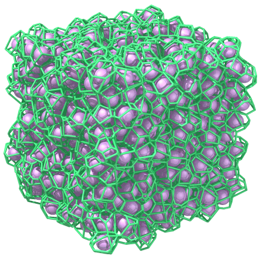

# Povray projects

Project: [Electrocatalytic nanomotors](https://github.com/AmirNi2016/Povray/tree/master/Electrocatalytic%20Nanomotors): used `spline` and `clock` for povray animation code. The final video (combined with experiental initial frame) is [ElectrocatalyticNanomotor.mp4](https://github.com/AmirNi2016/Povray/blob/master/Electrocatalytic%20Nanomotors/ElectrocatalyticNanomotor.mp4)

Project: [Packed spheres in a box](https://github.com/AmirNi2016/Povray/tree/master/Packed%20Speheres%20in%20a%20box). The voronoi tessellation is done using http://math.lbl.gov/voro++/, and the video [PackedSpheres.mp4](https://github.com/AmirNi2016/Povray/blob/master/Packed%20Speheres%20in%20a%20box/PackedSpheres.mp4)
of packing is made following the cylinder sample. 

